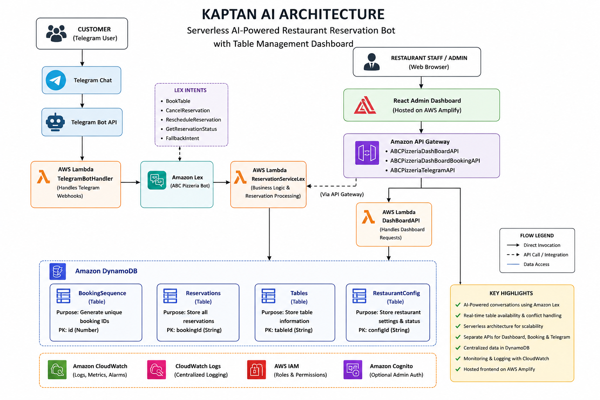
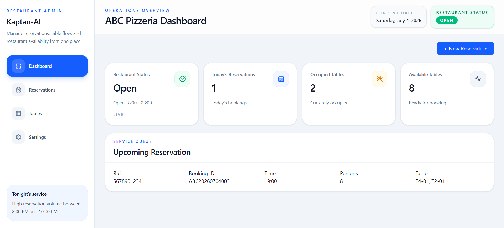
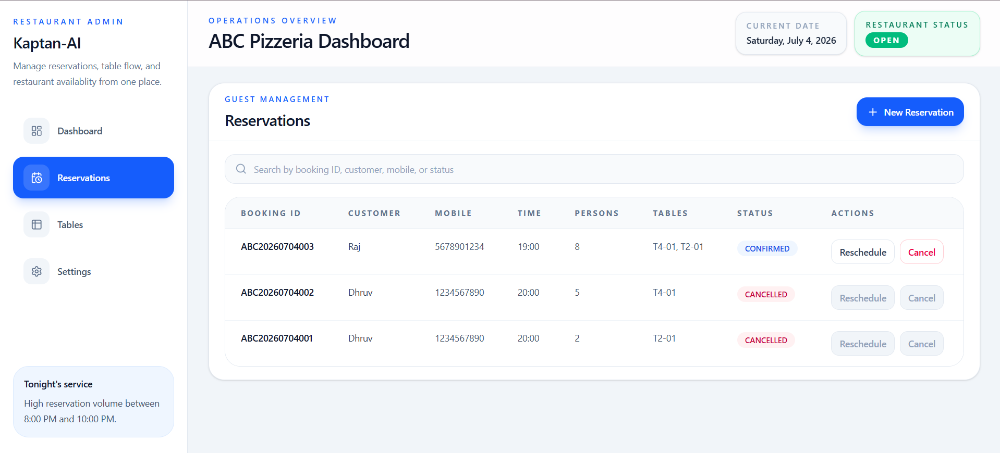
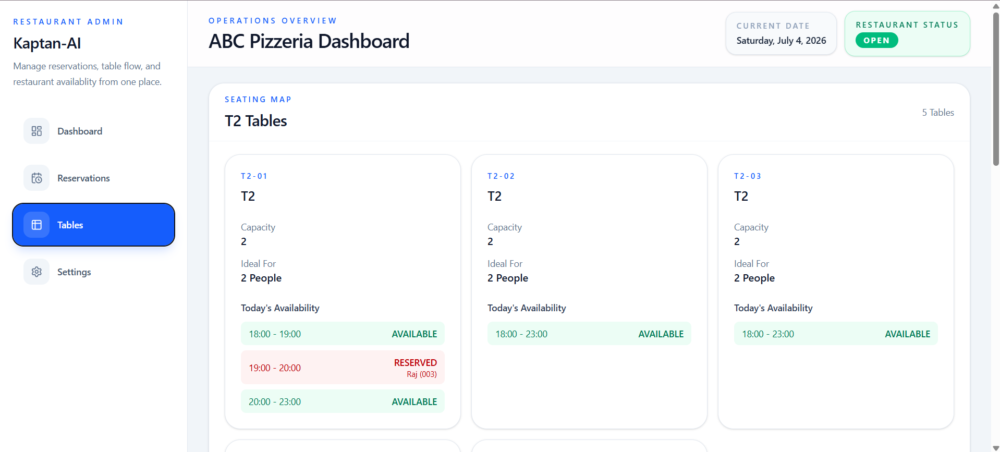
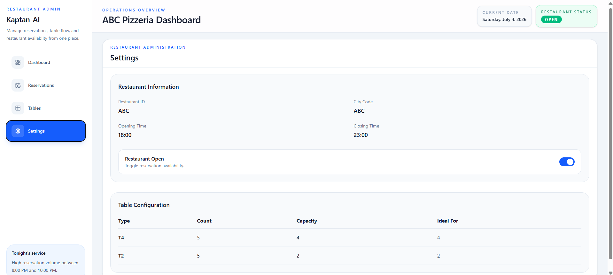
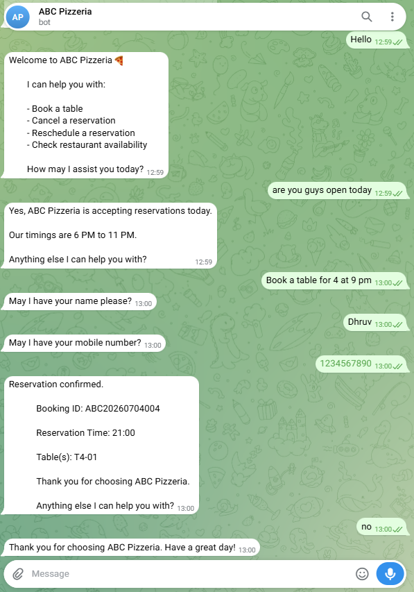

# Kaptan AI

> **Serverless AI-Powered Restaurant Reservation Bot with Table Management Dashboard**

Kaptan AI is a cloud-native restaurant reservation platform that enables customers to book, cancel, and reschedule reservations through a conversational Telegram bot while providing restaurant staff with a real-time web dashboard to manage reservations, monitor table availability, and control restaurant operations.

---

## 🚀 Live Demo

🌐 **Frontend:** https://main.d2knn50087pxtx.amplifyapp.com/

🌐 **Telegram Bot Url:** https://t.me/ABCPizzeriaReservationBot

---

## ✨ Features

### 🤖 AI Reservation Bot

- Book restaurant tables through Telegram
- Cancel existing reservations
- Reschedule reservations
- Conversational booking using Amazon Lex
- Intelligent slot validation
- Automatic table allocation
- Restaurant open/closed validation

---

### 📊 Admin Dashboard

- Dashboard overview
- Live reservation statistics
- Upcoming reservation summary
- Reservation management
- Create reservation
- Cancel reservation
- Reschedule reservation
- Search reservations
- Restaurant open/close toggle
- Table availability timeline
- Restaurant configuration

---

### 🍽️ Smart Table Allocation

- Automatic table assignment
- Supports multiple table types
- Prevents overlapping reservations
- Timeline-based availability visualization

Example:

```
18:00 - 20:30   Available

20:30 - 21:30   Reserved
Dhruv Patel (006)

21:30 - 22:30   Reserved
Rahul Shah (007)

22:30 - 23:00   Available
```

---

## ☁️ AWS Services Used

- Amazon Lex
- AWS Lambda
- Amazon DynamoDB
- Amazon API Gateway
- AWS Amplify
- Amazon CloudWatch

---

## 🛠 Tech Stack

### Frontend

- React
- Vite
- Tailwind CSS
- Axios

### Backend

- Python
- AWS Lambda

### Database

- Amazon DynamoDB

### AI

- Amazon Lex

### Communication

- Telegram Bot API

---

## 🏗 Architecture



---

## 📂 Project Structure

```
Kaptan-AI
│
├── frontend/
│
├── backend/
│   ├── DashboardAPI/
│   ├── ReservationServiceLex/
│   └── TelegramBotHandler/
│
├── architecture/
│
├── screenshots/
│
├── docs/
│
└── README.md
```

---

## 📸 Screenshots

### Dashboard



---

### Reservations



---

### Tables



---

### Settings



---

### Telegram Reservation



---

## ⚙️ Setup

### Clone Repository

```bash
git clone https://github.com/dhruv-patel-04/Kaptan-AI.git
```

---

### Frontend

```bash
cd frontend

npm install

npm run dev
```

Create a `.env` file

```env
VITE_DASHBOARD_API=YOUR_DASHBOARD_API

VITE_RESERVATION_API=YOUR_RESERVATION_API
```

---

### Backend

Deploy the Lambda functions located in:

```
backend/
```

Configure:

- DynamoDB
- Amazon Lex
- API Gateway
- Telegram Bot
- Amplify

Detailed setup instructions are available in the `docs/` directory.

---

## 📌 Future Enhancements

- SMS Notifications
- WhatsApp Integration
- Voice Calling Support
- QR Code Check-In
- Analytics Dashboard
- Multi-Restaurant Support
- Role-Based Authentication

---

## 👨‍💻 Author

**Dhruv Patel**

GitHub:
https://github.com/dhruv-patel-04

LinkedIn:
https://www.linkedin.com/in/pateldhruv04

---

## 📄 License

This project is licensed under the MIT License.
