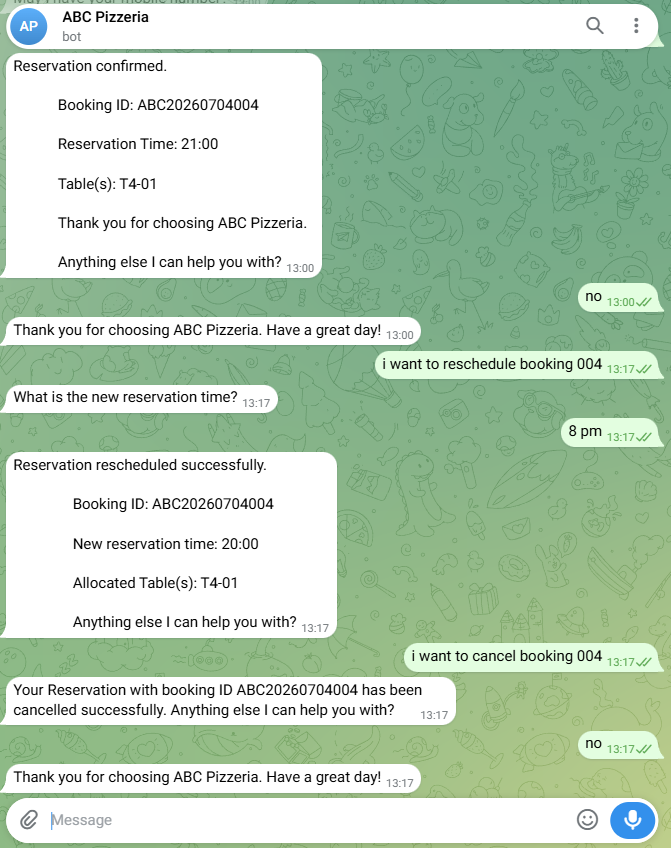

# Kaptan AI - Complete Setup Guide

> **Kaptan AI -- Serverless AI-Powered Restaurant Reservation Bot with
> Table Management Dashboard**

This guide explains how to recreate **Kaptan AI** from scratch on a new
AWS account. It is intended to serve as both deployment documentation
and future reference.

------------------------------------------------------------------------

# Architecture

Refer to the architecture diagram before beginning.


------------------------------------------------------------------------

# Prerequisites

-   AWS Account
-   GitHub Account
-   Telegram Account
-   Node.js 18+
-   Python 3.12
-   VS Code (Recommended)

Clone the repository:

```bash
git clone https://github.com/dhruv-patel-04/Kaptan-AI.git
cd Kaptan-AI
```

------------------------------------------------------------------------

# 1. Create DynamoDB Tables

Create the following tables:

| Table | Purpose |
| --- | --- |
| BookingSequence | Booking sequence counter |
| Reservations | Reservation records |
| RestaurantConfig | Restaurant configuration |
| Tables | Restaurant table inventory |


### RestaurantConfig

Create one record with the following values:

- restaurantId = ABC
- cityCode = ABC
- openingTime = 18:00
- closingTime = 23:00
- isOpen = true
- slotDuration = 30


### BookingSequence

Create one record:

- id = 1
- sequence = 0


### Tables

Insert your restaurant tables. Example:

- T2-01
- T2-02
- T4-01
- T4-02


## 2. Deploy Lambda Functions

Create three Lambda functions using **Python 3.12**.

- DashboardAPI
- ReservationServiceLex
- TelegramBotHandler

Upload the corresponding source code from the backend directory.


### IAM Permissions

Attach an IAM role with DynamoDB read/write permissions.

> Ensure every Lambda function uses the same DynamoDB table names.


## 3. Configure Amazon Lex

Create a Lex bot and add these intents:

- WelcomeIntent
- BookReservationIntent
- CancelReservationIntent
- RescheduleReservationIntent
- RestaurantStatusIntent
- GoodbyeIntent
- FallbackIntent

Add sample utterances for all slot-based intents. FallbackIntent does not require sample utterances.

Configure the slots exactly as defined in the project, then connect the bot to the ReservationServiceLex Lambda and build the bot.


### Intent and Slot Screenshots


## 4. Configure API Gateway

Create three HTTP APIs:

- ABCPizzeriaDashBoardAPI
- ABCPizzeriaDashBoardBookingAPI
- ABCPizzeriaTelegramAPI

Configure routes and integrations for each API.


### Enable CORS

Development origin:

```text
http://localhost:5173
```

Production origin:

```text
https://YOUR-AMPLIFY-DOMAIN.amplifyapp.com
```

Allowed methods:

- POST
- OPTIONS

Allowed headers:

```text
*
```


## 5. Configure Telegram Bot

Create a bot with BotFather and save the generated bot token.

Configure the webhook to point to the Telegram API Gateway endpoint:

```text
https://YOUR-TELEGRAM-API/webhook
```

Update the TelegramBotHandler Lambda environment variables with the bot token and Lex configuration.

If the Lambda invoke URL is:

```text
https://abcd1234.execute-api.ap-southeast-1.amazonaws.com
```

Then the webhook URL becomes:

```text
https://abcd1234.execute-api.ap-southeast-1.amazonaws.com/webhook
```


## 6. Configure the Frontend

Go to the frontend directory:

```bash
cd frontend
```

Install dependencies:

```bash
npm install
```

Create a `.env` file:

```env
VITE_DASHBOARD_API=YOUR_DASHBOARD_API
VITE_RESERVATION_API=YOUR_RESERVATION_API
```

Run the app locally:

```bash
npm run dev
```

The dashboard should open at:

```text
http://localhost:5173
```

## 7. Deploy with AWS Amplify

Push the repository to GitHub, then in AWS Amplify:

- Host Web App
- Connect GitHub Repository
- Select the main branch
- Set App Root to `frontend`

Configure environment variables:

- `VITE_DASHBOARD_API`
- `VITE_RESERVATION_API`

Deploy the app.

## 8. Production CORS

After Amplify deployment, update the CORS configuration for:

- ABCPizzeriaDashBoardAPI
- ABCPizzeriaDashBoardBookingAPI

Add the Amplify domain as an allowed origin, for example:

```text
https://main.xxxxxxxxx.amplifyapp.com
```

## 9. Verification Checklist

Verify the following:

- Dashboard loads successfully
- Reservations page works
- Tables page displays the timeline
- Settings page loads
- Restaurant open/close toggle works
- Telegram booking works
- Telegram cancellation works
- Telegram rescheduling works
- Amplify deployment works
- API Gateway CORS works

## Frontend Verification Screenshots




## Troubleshooting

### Dashboard not loading

- Verify the DashboardAPI Lambda.
- Verify the Dashboard API Gateway.
- Verify Amplify environment variables.

### Telegram bot not responding

- Verify the bot token.
- Verify the webhook.
- Verify TelegramBotHandler logs in CloudWatch.

### Lex not invoking Lambda

- Verify the alias.
- Verify the Lambda integration.
- Rebuild the bot after changes.

### CORS error

Add the Amplify domain to the HTTP API CORS configuration.

### DynamoDB errors

Ensure all Lambda functions reference the correct table names and that the initial records exist.

## Future Enhancements

- Multi-restaurant support
- WhatsApp integration
- QR code check-in
- Online payments
- Analytics dashboard
- Role-based authentication

## Notes

This project was developed as a serverless cloud-native application using:

- Amazon Lex
- AWS Lambda
- Amazon DynamoDB
- Amazon API Gateway
- AWS Amplify
- Telegram Bot API
- React
- Tailwind CSS

    VITE_RESERVATION_API

Deploy.

------------------------------------------------------------------------

# 8. Production CORS

After Amplify deployment, update the CORS configuration of:

-   ABCPizzeriaDashBoardAPI
-   ABCPizzeriaDashBoardBookingAPI

Add the Amplify domain as an Allowed Origin.

Example:

    https://main.xxxxxxxxx.amplifyapp.com

Save the configuration.

------------------------------------------------------------------------

# 9. Verification Checklist

Verify the following:

-   Dashboard loads
-   Reservations page works
-   Tables page displays timeline
-   Settings page loads
-   Restaurant Open/Close toggle works
-   Telegram booking works
-   Telegram cancellation works
-   Telegram rescheduling works
-   Amplify deployment works
-   API Gateway CORS works

------------------------------------------------------------------------

# Troubleshooting

## Dashboard Not Loading

-   Verify DashboardAPI Lambda.
-   Verify Dashboard API Gateway.
-   Verify Amplify Environment Variables.

## Telegram Bot Not Responding

-   Verify Bot Token.
-   Verify Webhook.
-   Verify TelegramBotHandler logs in CloudWatch.

## Lex Not Invoking Lambda

-   Verify Alias.
-   Verify Lambda integration.
-   Rebuild the bot after changes.

## CORS Error

Add the Amplify domain to the HTTP API CORS configuration.

## DynamoDB Errors

Ensure all Lambda functions reference the correct table names and that
the initial records exist.

------------------------------------------------------------------------

# Future Enhancements

-   Multi-Restaurant Support
-   WhatsApp Integration
-   QR Code Check-In
-   Online Payments
-   Analytics Dashboard
-   Role-Based Authentication

------------------------------------------------------------------------

# Notes

This project was developed as a serverless cloud-native application
using:

-   Amazon Lex
-   AWS Lambda
-   Amazon DynamoDB
-   Amazon API Gateway
-   AWS Amplify
-   Telegram Bot API
-   React
-   Tailwind CSS